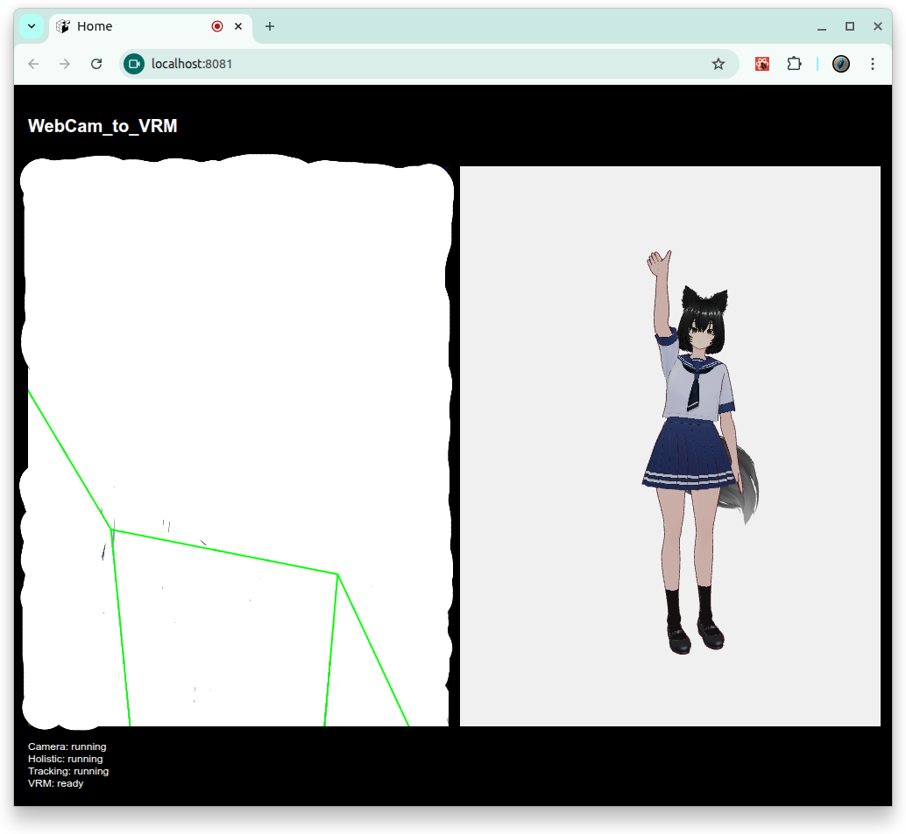

# [WebCam to Avartar](https://github.com/europanite/vre "WebCam to Avartar")

[](https://opensource.org/licenses/Apache-2.0)

[](https://github.com/europanite/webcam_to_avatar/actions/workflows/ci.yml)
[](https://github.com/europanite/webcam_to_avatar/actions/workflows/docker.yml)
[](https://github.com/europanite/webcam_to_avatar/actions/workflows/deploy-pages.yml)




[PlayGround](https://europanite.github.io/webcam_to_avatar/)

A Playground to controle a vroid avatar with user pose estimation.

---

## ✨ Features

- **Real-time avatar control**  
  - Uses MediaPipe **Holistic / Thunder** model as a pose detector.  
  - Tracks **body, face, and both hands** from the webcam feed.

- **VRoid / VRM support**  
  - Loads a VRoid avatar (`VRoid_Woman.vrm`) via `GLTFLoader` and `VRMLoaderPlugin`.  
  - Applies Kalidokit’s solved pose/face/hand data to the humanoid rig.

- **Runs entirely in the browser**  
  - No backend is required for pose estimation or avatar control.  
  - All processing stays on the client for privacy.

- **Expo + React Native for Web**  
  - Implemented as an Expo app and exported to static web.  
  - Easy to run in development mode on mobile or web.

---

## Current Architecture

```text
Web camera
  ↓
@mediapipe/pose on the frontend
  ↓
poseLandmarks + poseWorldLandmarks
  ↓
PosePerson-compatible object
  ↓
Kalidokit.Pose.solve(..., { runtime: "mediapipe", enableLegs: true })
  ↓
VRM humanoid normalized bones
  ↓
Three.js render loop
```

Important points:

- The current implementation is **frontend-only**.
- MediaPipe Pose is loaded from CDN: `@mediapipe/pose@0.5`.
- OpenPose itself is **not** executed in the browser.
- BODY_25-like points are kept mainly for **debug display**, not as the main VRM-driving path.
- The avatar-driving path should match the Kalidokit-based path used by `pose_estimation`.

---

## 🧰 How It Works

At a high level, the pipeline is:

1. **Webcam capture**  
   - The browser captures your webcam stream (portrait-oriented, e.g. 480×640).  

2. **MediaPipe Holistic (Thunder)**  
   - Holistic is dynamically loaded from a CDN at runtime to avoid bundler issues like  
     `"Holistic is not a constructor"`.  
   - It produces:
     - 2D and 3D **pose landmarks**  
     - **Face landmarks**  
     - **Left / right hand landmarks**

3. **Kalidokit solving**  
   - Kalidokit consumes the landmarks and solves:
     - **RiggedPose** (body / hips / spine / limbs)  
     - **RiggedFace** (eyes, mouth, head rotation, etc.)  
     - **RiggedHand** for left and right hands  

4. **VRM rigging (Three.js + @pixiv/three-vrm)**  
   - A VRM avatar is loaded and normalized (using `VRMUtils.removeUnnecessaryJoints()` and `VRMUtils.rotateVRM0()`).  
   - The solved Kalidokit data is applied to the VRM humanoid bones (hips, spine, arms, fingers, etc.).  
   - A Three.js render loop updates the avatar every frame.

5. **UI / controls**  
   - A simple settings bar lets you:
     - Start/stop camera and tracking  
     - See status (camera / Holistic / VRM)  
     - Open links (e.g. repository, demo)

---

## 🏗️ Tech Stack

- **Frontend**
  - [Expo](https://expo.dev/) / React Native
  - React Native for Web
  - TypeScript / TSX

- **3D & Avatar**
  - [Three.js](https://threejs.org/)
  - [`@pixiv/three-vrm`](https://github.com/pixiv/three-vrm) for VRM avatars
  - `GLTFLoader` + `VRMLoaderPlugin`

- **Pose & Animation**
  - MediaPipe Holistic (**Thunder** model)
  - [Kalidokit](https://github.com/yeemachine/kalidokit) for rigging

- **Tooling / Infra**
  - Docker & Docker Compose
  - GitHub Actions (CI, Docker tests, GitHub Pages deployment)
---

## 🧪 Sample Model

The sample avatar in this repository is provided by **「メタバースヨコスカ」**.  
For more details, see: https://metaverse-yokosuka.com/

---

## Avatar Definition

The avatar is a VRM humanoid model loaded through Three.js:

```ts
const loader = new GLTFLoader();
loader.register((parser) => new VRMLoaderPlugin(parser));
```

After loading, the avatar is normalized and placed in the scene:

```ts
VRMUtils.removeUnnecessaryVertices(gltf.scene);
VRMUtils.removeUnnecessaryJoints(gltf.scene);

vrm.scene.position.set(0, -1.05, 0);
vrm.scene.rotation.set(0, Math.PI, 0);
vrm.scene.scale.setScalar(1.0);
vrm.humanoid.resetNormalizedPose();
vrm.humanoid.update();
```

Key findings:

- Keep the VRM root transform stable.
- Do not move the whole avatar every frame using `Kalidokit.Hips.position`.
- Use VRM humanoid **normalized bone names**, not raw Three.js skeleton bone names.
- Apply rotations through `vrm.humanoid.getNormalizedBoneNode(...)`.

---

## VRM Bone Mapping

The TypeScript implementation uses these VRM normalized humanoid bone names:

```ts
const VRM_BONE_NAMES = {
  hips: "hips",
  spine: "spine",
  chest: "chest",
  upperChest: "upperChest",
  neck: "neck",
  head: "head",
  leftUpperArm: "leftUpperArm",
  leftLowerArm: "leftLowerArm",
  leftHand: "leftHand",
  rightUpperArm: "rightUpperArm",
  rightLowerArm: "rightLowerArm",
  rightHand: "rightHand",
  leftUpperLeg: "leftUpperLeg",
  leftLowerLeg: "leftLowerLeg",
  leftFoot: "leftFoot",
  rightUpperLeg: "rightUpperLeg",
  rightLowerLeg: "rightLowerLeg",
  rightFoot: "rightFoot",
};
```

The application path is:

```ts
const bone = vrm.humanoid.getNormalizedBoneNode(boneName);
bone.rotation.set(x, y, z, "XYZ");
```

This is different from directly manipulating arbitrary Three.js skeleton bones. A visible `SkeletonHelper` confirms that the VRM skeleton exists, but it does not prove that the avatar is being driven correctly through the VRM humanoid normalized bones.

---

## MediaPipe Landmarks and BODY_25 Compatibility

MediaPipe Pose returns 33 landmarks. For debug display and comparison, the app also builds BODY_25-like names:

```ts
const BODY25_TO_MEDIAPIPE = {
  Nose: 0,
  Neck: null,
  RShoulder: 12,
  RElbow: 14,
  RWrist: 16,
  LShoulder: 11,
  LElbow: 13,
  LWrist: 15,
  MidHip: null,
  RHip: 24,
  RKnee: 26,
  RAnkle: 28,
  LHip: 23,
  LKnee: 25,
  LAnkle: 27,
  REye: 5,
  LEye: 2,
  REar: 8,
  LEar: 7,
  LBigToe: 31,
  LHeel: 29,
  RBigToe: 32,
  RHeel: 30,
};
```

Synthetic helper joints:

- `Neck` is the average of left shoulder and right shoulder.
- `MidHip` is the average of left hip and right hip.

Important conclusion:

- BODY_25-like bones are useful for **visual debugging**.
- They should not be mixed with Kalidokit Euler rotations as another avatar-control layer.
- Mixing BODY_25 retargeting and Kalidokit retargeting creates inconsistent arm, elbow, and leg axes.

---

## Coordinate Systems

This project uses three different coordinate spaces:

| Space | Data | Meaning |
|---|---|---|
| MediaPipe 2D | `poseLandmarks` | Normalized image-space coordinates. `x` and `y` are screen-based. |
| MediaPipe world | `poseWorldLandmarks` | 3D-like landmarks used by Kalidokit. |
| Three.js / VRM | Avatar scene | Y-up world. The VRM root is fixed at `(0, -1.05, 0)`. |

The avatar-control path requires both landmark sets:

```ts
person.mediapipeWorldLandmarks
person.mediapipeLandmarks
```

Then Kalidokit is called as follows:

```ts
Kalidokit.Pose.solve(
  person.mediapipeWorldLandmarks,
  person.mediapipeLandmarks,
  {
    runtime: "mediapipe",
    enableLegs: true,
  }
);
```

If `poseWorldLandmarks` is missing, a faithful `pose_estimation`-style path should not silently substitute 2D landmarks as world landmarks. That may make the avatar move, but it corrupts the coordinate system.

---

## Avatar Pose Application

The stable application order is:

```ts
const solvedPose = Kalidokit.Pose.solve(...);

vrm.humanoid.resetNormalizedPose();
applySolvedPose(vrm, solvedPose);
vrm.humanoid.update();
```

`applySolvedPose` maps Kalidokit output to VRM normalized bones:

```ts
applyRotation(vrm, "hips", solvedPose.Hips.rotation, 0.35);
applyRotation(vrm, "spine", solvedPose.Spine, 0.35);
applyRotation(vrm, "chest", solvedPose.Chest ?? solvedPose.Spine, 0.25);
applyRotation(vrm, "upperChest", solvedPose.Chest ?? solvedPose.Spine, 0.2);
applyRotation(vrm, "neck", solvedPose.Neck, 0.35);
applyRotation(vrm, "head", solvedPose.Head, 0.5);

applyRotation(vrm, "leftUpperArm", solvedPose.LeftUpperArm, 1.0);
applyRotation(vrm, "leftLowerArm", solvedPose.LeftLowerArm, 1.0);
applyRotation(vrm, "leftHand", solvedPose.LeftHand, 0.7);
applyRotation(vrm, "rightUpperArm", solvedPose.RightUpperArm, 1.0);
applyRotation(vrm, "rightLowerArm", solvedPose.RightLowerArm, 1.0);
applyRotation(vrm, "rightHand", solvedPose.RightHand, 0.7);

applyRotation(vrm, "leftUpperLeg", solvedPose.LeftUpperLeg, 0.8);
applyRotation(vrm, "leftLowerLeg", solvedPose.LeftLowerLeg, 0.8);
applyRotation(vrm, "leftFoot", solvedPose.LeftFoot, 0.6);
applyRotation(vrm, "rightUpperLeg", solvedPose.RightUpperLeg, 0.8);
applyRotation(vrm, "rightLowerLeg", solvedPose.RightLowerLeg, 0.8);
applyRotation(vrm, "rightFoot", solvedPose.RightFoot, 0.6);
```

Findings from debugging:

- Reconstructing upper/lower arm rotations manually from `shoulder → elbow → wrist` is fragile unless the rest axis and parent-local frame are calibrated exactly.
- The active `pose_estimation` VRM path is Kalidokit-based.
- Do not apply both custom BODY_25 quaternions and Kalidokit rotations to the same bones in the same frame.

---

## 🚀 Getting Started

### 1. Prerequisites
- [Docker Compose](https://docs.docker.com/compose/)

### 2. Build and start all services:

```bash
# set environment variables:
export REACT_NATIVE_PACKAGER_HOSTNAME=${YOUR_HOST}

# Build the image
docker compose build

# Run the container
docker compose up
```

### 3. Test:
```bash
docker compose \
-f docker-compose.test.yml up \
--build --exit-code-from \
frontend_test
```

---

# License
- Apache License 2.0