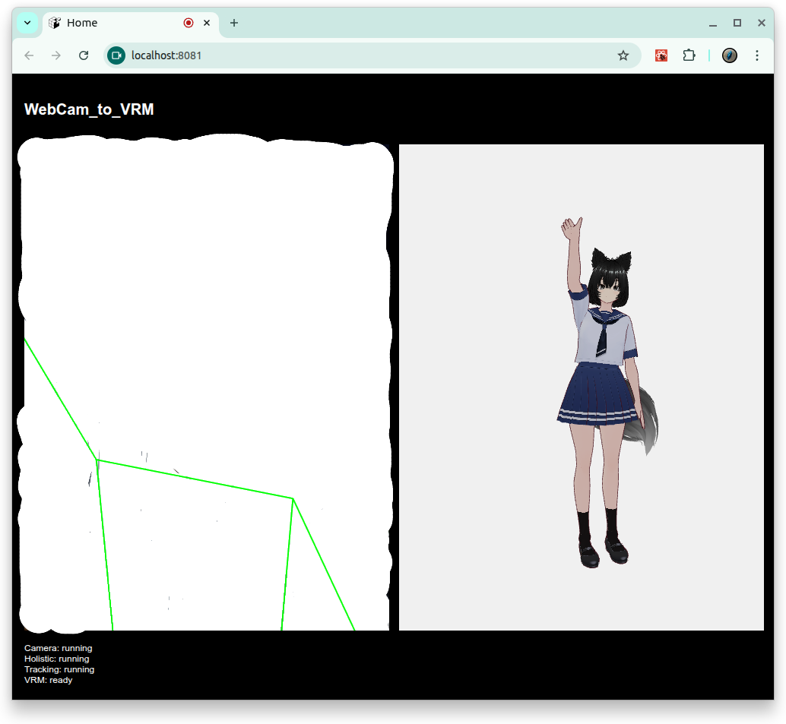

<!-- P2M_REPORT -->
<!-- GENERATED at 2025-11-11 19:44:06 -->
# Project Export: vre

## Overview

- Root: `/home/skinner/vre`
- Files: **40**
- Total size: **19293527 bytes**
- Total LOC: 1446 | SLOC: 1211 | TODOs: 0

### Language mix
- plain: 7
- javascript: 7
- markdown: 6
- tsx: 6
- yaml: 4
- typescript: 3
- json: 3
- html: 3
- dockerfile: 1

### Top 12 largest files (bytes)
- `frontend/app/public/avatar.vrm` — 19247088 bytes
- `LICENSE` — 11340 bytes
- `frontend/app/src/VrmSpeaker.web.tsx` — 6294 bytes
- `.gitignore` — 4688 bytes
- `CODE_OF_CONDUCT.md` — 4085 bytes
- `README.md` — 2551 bytes
- `frontend/app/screens/HomeScreen.tsx` — 1589 bytes
- `.github/workflows/deploy-pages.yml` — 1184 bytes
- `frontend/app/components/SettingsBar.tsx` — 1046 bytes
- `frontend/app/jest.config.ts` — 1011 bytes
- `frontend/app/context/Auth.tsx` — 1001 bytes
- `frontend/app/App.tsx` — 991 bytes

### Top 12 longest files (LOC)
- `frontend/app/src/VrmSpeaker.web.tsx` — 209 LOC
- `.gitignore` — 207 LOC
- `LICENSE` — 201 LOC
- `README.md` — 88 LOC
- `CODE_OF_CONDUCT.md` — 68 LOC
- `frontend/app/screens/HomeScreen.tsx` — 66 LOC
- `.github/workflows/deploy-pages.yml` — 47 LOC
- `frontend/app/webpack.config.js` — 40 LOC
- `frontend/app/.gitignore` — 37 LOC
- `frontend/app/context/Auth.tsx` — 35 LOC
- `.dockerignore` — 34 LOC
- `frontend/app/app.json` — 34 LOC

### Project tree (included subset)
```
vre/
├── .github/
│   ├── ISSUE_TEMPLATE/
│   │   └── bug_report.md
│   ├── workflows/
│   │   └── deploy-pages.yml
│   └── pull_request_template.md
├── frontend/
│   ├── app/
│   │   ├── .expo/
│   │   │   ├── devices.json
│   │   │   └── README.md
│   │   ├── __mocks__/
│   │   │   ├── expoConstantsMock.js
│   │   │   ├── expoMock.js
│   │   │   └── expoRouterMock.js
│   │   ├── __tests__/
│   │   │   └── smoke.test.tsx
│   │   ├── components/
│   │   │   └── SettingsBar.tsx
│   │   ├── context/
│   │   │   └── Auth.tsx
│   │   ├── public/
│   │   │   ├── 404.html
│   │   │   ├── _config.yml
│   │   │   ├── avatar.vrm
│   │   │   ├── google095bf08db4fb15d0.html
│   │   │   └── index.html
│   │   ├── screens/
│   │   │   └── HomeScreen.tsx
│   │   ├── src/
│   │   │   └── VrmSpeaker.web.tsx
│   │   ├── .gitignore
│   │   ├── app.json
│   │   ├── App.tsx
│   │   ├── babel.config.js
│   │   ├── index.ts
│   │   ├── jest.config.ts
│   │   ├── jest.setup.ts
│   │   ├── jest.setupFiles.js
│   │   ├── metro.config.js
│   │   ├── tsconfig.json
│   │   └── webpack.config.js
│   ├── Dockerfile
│   └── Dockerfile.test
├── .dockerignore
├── .env
├── .gitignore
├── CODE_OF_CONDUCT.md
├── CONTRIBUTING.md
├── docker-compose.test.yml
├── docker-compose.yml
├── LICENSE
└── README.md
```

## Table of contents (files)

- 1. [.dockerignore](#.dockerignore)
- 2. [.env](#.env)
- 3. [.github/ISSUE_TEMPLATE/bug_report.md](#.github-ISSUE_TEMPLATE-bug_report.md)
- 4. [.github/pull_request_template.md](#.github-pull_request_template.md)
- 5. [.github/workflows/deploy-pages.yml](#.github-workflows-deploy-pages.yml)
- 6. [.gitignore](#.gitignore)
- 7. [CODE_OF_CONDUCT.md](#CODE_OF_CONDUCT.md)
- 8. [CONTRIBUTING.md](#CONTRIBUTING.md)
- 9. [docker-compose.test.yml](#docker-compose.test.yml)
- 10. [docker-compose.yml](#docker-compose.yml)
- 11. [frontend/app/.expo/devices.json](#frontend-app-.expo-devices.json)
- 12. [frontend/app/.expo/README.md](#frontend-app-.expo-README.md)
- 13. [frontend/app/.gitignore](#frontend-app-.gitignore)
- 14. [frontend/app/__mocks__/expoConstantsMock.js](#frontend-app-__mocks__-expoConstantsMock.js)
- 15. [frontend/app/__mocks__/expoMock.js](#frontend-app-__mocks__-expoMock.js)
- 16. [frontend/app/__mocks__/expoRouterMock.js](#frontend-app-__mocks__-expoRouterMock.js)
- 17. [frontend/app/__tests__/smoke.test.tsx](#frontend-app-__tests__-smoke.test.tsx)
- 18. [frontend/app/app.json](#frontend-app-app.json)
- 19. [frontend/app/App.tsx](#frontend-app-App.tsx)
- 20. [frontend/app/babel.config.js](#frontend-app-babel.config.js)
- 21. [frontend/app/components/SettingsBar.tsx](#frontend-app-components-SettingsBar.tsx)
- 22. [frontend/app/context/Auth.tsx](#frontend-app-context-Auth.tsx)
- 23. [frontend/app/index.ts](#frontend-app-index.ts)
- 24. [frontend/app/jest.config.ts](#frontend-app-jest.config.ts)
- 25. [frontend/app/jest.setup.ts](#frontend-app-jest.setup.ts)
- 26. [frontend/app/jest.setupFiles.js](#frontend-app-jest.setupFiles.js)
- 27. [frontend/app/metro.config.js](#frontend-app-metro.config.js)
- 28. [frontend/app/public/404.html](#frontend-app-public-404.html)
- 29. [frontend/app/public/_config.yml](#frontend-app-public-_config.yml)
- 30. [frontend/app/public/avatar.vrm](#frontend-app-public-avatar.vrm)
- 31. [frontend/app/public/google095bf08db4fb15d0.html](#frontend-app-public-google095bf08db4fb15d0.html)
- 32. [frontend/app/public/index.html](#frontend-app-public-index.html)
- 33. [frontend/app/screens/HomeScreen.tsx](#frontend-app-screens-HomeScreen.tsx)
- 34. [frontend/app/src/VrmSpeaker.web.tsx](#frontend-app-src-VrmSpeaker.web.tsx)
- 35. [frontend/app/tsconfig.json](#frontend-app-tsconfig.json)
- 36. [frontend/app/webpack.config.js](#frontend-app-webpack.config.js)
- 37. [frontend/Dockerfile](#frontend-Dockerfile)
- 38. [frontend/Dockerfile.test](#frontend-Dockerfile.test)
- 39. [LICENSE](#LICENSE)
- 40. [README.md](#README.md)

---

## Files

<a id=".dockerignore"></a>
### 1. `.dockerignore`
- Size: 305 bytes | LOC: 34 | SLOC: 29 | TODOs: 0 | Modified: 2025-11-11 19:13:37 | SHA1: 4ddfad028bab

#### Brief
# Git
.git

#### Auto Summary
# Git

#### Content

```
# Git
.git
.gitignore

# Python cache
__pycache__/
*.py[cod]
*.pyo
*.pyd

# Node
node_modules/
npm-debug.log*
yarn-debug.log*
yarn-error.log*

# Local env/config
.env
*.env
*.local

# OS / IDE
.DS_Store
Thumbs.db
desktop.ini
.vscode/
.idea/

# Build artifacts
dist/
build/
web-build/
.expo/
.expo-shared/
```

<a id=".env"></a>
### 2. `.env`
- Size: 230 bytes | LOC: 6 | SLOC: 6 | TODOs: 0 | Modified: 2025-11-11 19:13:37 | SHA1: ee13beb2355e

#### Brief
# Frontend (Expo)
EXPO_TUNNEL=false

#### Auto Summary
# Frontend (Expo)

#### Content

```
# Frontend (Expo)
EXPO_TUNNEL=false
EXPO_DEVTOOLS_LISTEN_ADDRESS=0.0.0.0
EXPO_PUBLIC_API_HOST=${REACT_NATIVE_PACKAGER_HOSTNAME}
EXPO_PUBLIC_API_PORT=8000
EXPO_PUBLIC_API_BASE=http://${EXPO_PUBLIC_API_HOST}:${EXPO_PUBLIC_API_PORT}
```

<a id=".github-ISSUE_TEMPLATE-bug_report.md"></a>
### 3. `.github/ISSUE_TEMPLATE/bug_report.md`
- Size: 666 bytes | LOC: 30 | SLOC: 24 | TODOs: 0 | Modified: 2025-11-11 19:13:37 | SHA1: 4b4d2b96744a

#### Brief
---
name: Bug Report

#### Auto Summary
Description

#### Content (verbatim)

```markdown
---
name: Bug Report
about: Create a report to help us improve
title: "[Bug] "
labels: bug
assignees: ''
---

## Description
<!-- A clear and concise description of what the bug is -->

## Steps to Reproduce
1. Go to '...'
2. Click on '....'
3. Scroll down to '....'
4. See error

## Expected Behavior
<!-- A clear and concise description of what you expected to happen -->

## Screenshots
<!-- If applicable, add screenshots to help explain your problem -->

## Environment
- OS: [e.g. Ubuntu 22.04]
- Browser/Version: [e.g. Chrome 117]
- Node/Python Version: [e.g. Node 18, Python 3.10]

## Additional Context
<!-- Add any other context about the problem here -->
```

<a id=".github-pull_request_template.md"></a>
### 4. `.github/pull_request_template.md`
- Size: 744 bytes | LOC: 27 | SLOC: 21 | TODOs: 0 | Modified: 2025-11-11 19:13:37 | SHA1: 1b6e1aab4d9a

#### Brief
# Pull Request

#### Auto Summary
Pull Request

#### Content (verbatim)

```markdown
# Pull Request

## Overview
<!-- Briefly describe the purpose of this PR and the problem it solves   -->

## Changes
<!-- List the main changes made in this PR -->
- 

## Testing
<!-- Describe how you tested the changes -->
- [ ] Built and ran locally without errors
- [ ] All tests passed
- [ ] Verified functionality manually (describe how)

## Related Issues
<!-- Link to related issues if applicable -->
- Closes #

## Checklist
- [ ] Code is clean and free of unnecessary comments/debug prints
- [ ] Proper naming conventions and documentation are followed
- [ ] Updated documentation/README if necessary
- [ ] CI pipeline passes successfully

## Notes for Reviewers
<!-- Additional context or things reviewers should pay attention to -->
```

<a id=".github-workflows-deploy-pages.yml"></a>
### 5. `.github/workflows/deploy-pages.yml`
- Size: 1184 bytes | LOC: 47 | SLOC: 47 | TODOs: 0 | Modified: 2025-11-11 19:13:37 | SHA1: 7b4f25958db5

#### Brief
name: GitHub Pages
on:

#### Auto Summary
name: GitHub Pages

#### Content

```yaml
name: GitHub Pages
on:
  push:
    branches: [ "main" ]
  workflow_dispatch:
permissions:
  contents: read
  pages: write
  id-token: write
concurrency:
  group: "pages"
  cancel-in-progress: true
jobs:
  build:
    if: github.ref == 'refs/heads/main'
    runs-on: ubuntu-latest
    steps:
      - name: Checkout
        uses: actions/checkout@v4
      - name: Use Node.js 20
        uses: actions/setup-node@v4
        with:
          node-version: 20
          cache: npm
          cache-dependency-path: |
            frontend/app/package-lock.json
      - name: Install deps
        working-directory: frontend/app
        run: npm ci
      - name: Build (expo export -p web)
        working-directory: frontend/app
        run: npx expo export -p web
      - name: Upload Pages artifact
        uses: actions/upload-pages-artifact@v3
        with:
          path: frontend/app/dist
  deploy:
    if: github.ref == 'refs/heads/main'
    needs: build
    runs-on: ubuntu-latest
    environment:
      name: github-pages
      url: ${{ steps.deployment.outputs.page_url }}
    steps:
      - name: Deploy to GitHub Pages
        id: deployment
        uses: actions/deploy-pages@v4
```

<a id=".gitignore"></a>
### 6. `.gitignore`
- Size: 4688 bytes | LOC: 207 | SLOC: 170 | TODOs: 0 | Modified: 2025-11-11 19:13:37 | SHA1: b24ae32103d3

#### Brief
# Byte-compiled / optimized / DLL files
__pycache__/

#### Auto Summary
# Byte-compiled / optimized / DLL files

#### Content

```
# Byte-compiled / optimized / DLL files
__pycache__/
*.py[codz]
*$py.class

# C extensions
*.so

# Distribution / packaging
.Python
build/
develop-eggs/
dist/
downloads/
eggs/
.eggs/
lib/
lib64/
parts/
sdist/
var/
wheels/
share/python-wheels/
*.egg-info/
.installed.cfg
*.egg
MANIFEST

# PyInstaller
#  Usually these files are written by a python script from a template
#  before PyInstaller builds the exe, so as to inject date/other infos into it.
*.manifest
*.spec

# Installer logs
pip-log.txt
pip-delete-this-directory.txt

# Unit test / coverage reports
htmlcov/
.tox/
.nox/
.coverage
.coverage.*
.cache
nosetests.xml
coverage.xml
*.cover
*.py.cover
.hypothesis/
.pytest_cache/
cover/

# Translations
*.mo
*.pot

# Django stuff:
*.log
local_settings.py
db.sqlite3
db.sqlite3-journal

# Flask stuff:
instance/
.webassets-cache

# Scrapy stuff:
.scrapy

# Sphinx documentation
docs/_build/

# PyBuilder
.pybuilder/
target/

# Jupyter Notebook
.ipynb_checkpoints

# IPython
profile_default/
ipython_config.py

# pyenv
#   For a library or package, you might want to ignore these files since the code is
#   intended to run in multiple environments; otherwise, check them in:
# .python-version

# pipenv
#   According to pypa/pipenv#598, it is recommended to include Pipfile.lock in version control.
#   However, in case of collaboration, if having platform-specific dependencies or dependencies
#   having no cross-platform support, pipenv may install dependencies that don't work, or not
#   install all needed dependencies.
#Pipfile.lock

# UV
#   Similar to Pipfile.lock, it is generally recommended to include uv.lock in version control.
#   This is especially recommended for binary packages to ensure reproducibility, and is more
#   commonly ignored for libraries.
#uv.lock

# poetry
#   Similar to Pipfile.lock, it is generally recommended to include poetry.lock in version control.
#   This is especially recommended for binary packages to ensure reproducibility, and is more
#   commonly ignored for libraries.
#   https://python-poetry.org/docs/basic-usage/#commit-your-poetrylock-file-to-version-control
#poetry.lock
#poetry.toml

# pdm
#   Similar to Pipfile.lock, it is generally recommended to include pdm.lock in version control.
#   pdm recommends including project-wide configuration in pdm.toml, but excluding .pdm-python.
#   https://pdm-project.org/en/latest/usage/project/#working-with-version-control
#pdm.lock
#pdm.toml
.pdm-python
.pdm-build/

# pixi
#   Similar to Pipfile.lock, it is generally recommended to include pixi.lock in version control.
#pixi.lock
#   Pixi creates a virtual environment in the .pixi directory, just like venv module creates one
#   in the .venv directory. It is recommended not to include this directory in version control.
.pixi

# PEP 582; used by e.g. github.com/David-OConnor/pyflow and github.com/pdm-project/pdm
__pypackages__/

# Celery stuff
celerybeat-schedule
celerybeat.pid

# SageMath parsed files
*.sage.py

# Environments
.env
.envrc
.venv
env/
venv/
ENV/
env.bak/
venv.bak/

# Spyder project settings
.spyderproject
.spyproject

# Rope project settings
.ropeproject

# mkdocs documentation
/site

# mypy
.mypy_cache/
.dmypy.json
dmypy.json

# Pyre type checker
.pyre/

# pytype static type analyzer
.pytype/

# Cython debug symbols
cython_debug/

# PyCharm
#  JetBrains specific template is maintained in a separate JetBrains.gitignore that can
#  be found at https://github.com/github/gitignore/blob/main/Global/JetBrains.gitignore
#  and can be added to the global gitignore or merged into this file.  For a more nuclear
#  option (not recommended) you can uncomment the following to ignore the entire idea folder.
#.idea/

# Abstra
# Abstra is an AI-powered process automation framework.
# Ignore directories containing user credentials, local state, and settings.
# Learn more at https://abstra.io/docs
.abstra/

# Visual Studio Code
#  Visual Studio Code specific template is maintained in a separate VisualStudioCode.gitignore 
#  that can be found at https://github.com/github/gitignore/blob/main/Global/VisualStudioCode.gitignore
#  and can be added to the global gitignore or merged into this file. However, if you prefer, 
#  you could uncomment the following to ignore the entire vscode folder
# .vscode/

# Ruff stuff:
.ruff_cache/

# PyPI configuration file
.pypirc

# Cursor
#  Cursor is an AI-powered code editor. `.cursorignore` specifies files/directories to
#  exclude from AI features like autocomplete and code analysis. Recommended for sensitive data
#  refer to https://docs.cursor.com/context/ignore-files
.cursorignore
.cursorindexingignore

# Marimo
marimo/_static/
marimo/_lsp/
__marimo__/
```

<a id="CODE_OF_CONDUCT.md"></a>
### 7. `CODE_OF_CONDUCT.md`
- Size: 4085 bytes | LOC: 68 | SLOC: 50 | TODOs: 0 | Modified: 2025-11-11 19:13:37 | SHA1: 724cc33f0dca

#### Brief
# Contributor Covenant Code of Conduct

#### Auto Summary
Contributor Covenant Code of Conduct

#### Content (verbatim)

```markdown
# Contributor Covenant Code of Conduct

## Our Pledge
We as members, contributors, and leaders pledge to make participation in our community a harassment-free experience for everyone, regardless of age, body size, visible or invisible disability, ethnicity, sex characteristics, gender identity and expression, level of experience, education, socio-economic status, nationality, personal appearance, race, religion, or sexual identity and orientation.

We pledge to act and interact in ways that contribute to an open, welcoming, diverse, inclusive, and healthy community.

## Our Standards
Examples of behavior that contributes to a positive environment include:
- Demonstrating empathy and kindness toward other people
- Being respectful of differing opinions, viewpoints, and experiences
- Giving and gracefully accepting constructive feedback
- Taking responsibility and apologizing to those affected by our mistakes
- Focusing on what is best for the community, not just for ourselves

Examples of unacceptable behavior include:
- The use of sexualized language or imagery, and sexual attention or advances
- Trolling, insulting or derogatory comments, and personal or political attacks
- Public or private harassment
- Publishing others’ private information without explicit permission
- Other conduct which could reasonably be considered inappropriate in a professional setting

## Enforcement Responsibilities
Community leaders are responsible for clarifying and enforcing our standards of acceptable behavior and will take appropriate and fair corrective action in response to any behavior that they deem inappropriate, threatening, offensive,
or harmful.

## Scope
This Code of Conduct applies within all community spaces, and also applies when an individual is officially representing the community in public spaces.

## Enforcement
Instances of abusive, harassing, or otherwise unacceptable behavior may be reported by contacting the maintainers of this project. All complaints will be reviewed and investigated promptly and fairly.

All community leaders are obligated to respect the privacy and security of the reporter of any incident.

## Enforcement Guidelines
Community leaders will follow these guidelines in determining the consequences for any action they deem in violation of this Code of Conduct:

1. **Correction**  
- *Impact*: Use of inappropriate language or other behavior deemed unprofessional.  
- *Consequence*: A private, written warning, with clarity around the nature of the violation and an explanation of why the behavior was inappropriate.

2. **Warning**  
- *Impact*: A violation through a single incident or series of actions.  
- *Consequence*: A warning with consequences for continued behavior. No interaction with the people involved, including unsolicited interaction with those enforcing the Code of Conduct, for a specified period of time.

3. **Temporary Ban**  
- *Impact*: A serious violation of community standards, including sustained inappropriate behavior.  
- *Consequence*: A temporary ban from any sort of interaction or public communication with the community for a specified period of time.

4. **Permanent Ban**  
- *Impact*: Demonstrating a pattern of violation of community standards, including sustained inappropriate behavior, harassment of an individual, or aggression toward or disparagement of classes of individuals.  
- *Consequence*: A permanent ban from any sort of public interaction within the
   community.

## Attribution

This Code of Conduct is adapted from the  
- [Contributor Covenant][v2.1], version 2.1, available at [https://www.contributor-covenant.org/version/2/1/code_of_conduct.html][v2.1].

Community Impact Guidelines were inspired by  
- [Mozilla’s code of conduct enforcement ladder][mozilla-coc].

For answers to common questions about this code of conduct, see the FAQ at  
- [Contributor Covenant FAQ][faq].

[v2.1]: https://www.contributor-covenant.org/version/2/1/code_of_conduct.html
[mozilla-coc]: https://github.com/mozilla/diversity
[faq]: https://www.contributor-covenant.org/faq
```

<a id="CONTRIBUTING.md"></a>
### 8. `CONTRIBUTING.md`
- Size: 834 bytes | LOC: 25 | SLOC: 19 | TODOs: 0 | Modified: 2025-11-11 19:13:37 | SHA1: 12ea21d94090

#### Brief
# Contributing Guidelines

#### Auto Summary
Contributing Guidelines

#### Content (verbatim)

```markdown
# Contributing Guidelines

Thank you for considering contributing to this project!  
We welcome bug reports, feature requests, and pull requests.  
Please follow the guidelines below to make the process smooth for everyone.

---

## How to Contribute

### 1. Reporting Issues
- Check the [issue tracker](../../issues) to avoid duplicates.
- Use the appropriate [issue template](.github/ISSUE_TEMPLATE/) when creating a new issue.
- Provide as much detail as possible (steps to reproduce, expected behavior, environment, etc.).

### 2. Suggesting Features
- Open a new **Feature Request** issue.
- Explain the problem your idea solves.
- Provide examples, use cases, or references if possible.

### 3. Submitting Pull Requests
Fork the repository and create a new branch:
   ```bash
   git checkout -b feature/your-feature-name
   ```
```

<a id="docker-compose.test.yml"></a>
### 9. `docker-compose.test.yml`
- Size: 706 bytes | LOC: 21 | SLOC: 21 | TODOs: 0 | Modified: 2025-11-11 19:13:37 | SHA1: ae51e77ed333

#### Brief
services:
  frontend_test:

#### Auto Summary
services:

#### Content

```yaml
services:
  frontend_test:
    container_name: frontend_test
    build:
      context: ./frontend
      dockerfile: Dockerfile.test
    working_dir: /app
    environment:
      CI: "1"
      EXPO_TUNNEL: ${EXPO_TUNNEL}
      EXPO_DEVTOOLS_LISTEN_ADDRESS: ${EXPO_DEVTOOLS_LISTEN_ADDRESS}
      REACT_NATIVE_PACKAGER_HOSTNAME: ${REACT_NATIVE_PACKAGER_HOSTNAME}
      EXPO_PUBLIC_API_HOST: ${EXPO_PUBLIC_API_HOST}
      EXPO_PUBLIC_API_PORT: ${EXPO_PUBLIC_API_PORT}
      EXPO_PUBLIC_API_BASE: ${EXPO_PUBLIC_API_BASE}
    volumes:
      - ./frontend/app:/app
      - /app/node_modules
      - ./reports/frontend:/reports/frontend
    command: >-
      sh -lc "npm ci && npm test -- --ci --runInBand --verbose"
```

<a id="docker-compose.yml"></a>
### 10. `docker-compose.yml`
- Size: 887 bytes | LOC: 30 | SLOC: 30 | TODOs: 0 | Modified: 2025-11-11 19:13:37 | SHA1: 6798f1d1af83

#### Brief
services:
  frontend:

#### Auto Summary
services:

#### Content

```yaml
services:
  frontend:
    build:
      context: ./frontend
      dockerfile: Dockerfile
    container_name: frontend
    working_dir: /app
    stdin_open: true
    tty: true
    restart: unless-stopped
    volumes:
      - ./frontend/app:/app
      - /app/node_modules
    environment:
      EXPO_TUNNEL: ${EXPO_TUNNEL}
      EXPO_DEVTOOLS_LISTEN_ADDRESS: ${EXPO_DEVTOOLS_LISTEN_ADDRESS}
      REACT_NATIVE_PACKAGER_HOSTNAME: ${REACT_NATIVE_PACKAGER_HOSTNAME}
      EXPO_PUBLIC_API_HOST: ${EXPO_PUBLIC_API_HOST}
      EXPO_PUBLIC_API_PORT: ${EXPO_PUBLIC_API_PORT}
      EXPO_PUBLIC_API_BASE: ${EXPO_PUBLIC_API_BASE}
    ports:
      - "19000:19000"  # Expo dev server (Metro)
      - "19001:19001"  # React Native debugger(old)
      - "19002:19002"  # Expo web UI
      - "8081:8081"    # Metro bundler
    command: >
      sh -c "
        npm install &&
        npx expo start
      "
```

<a id="frontend-app-.expo-devices.json"></a>
### 11. `frontend/app/.expo/devices.json`
- Size: 20 bytes | LOC: 3 | SLOC: 3 | TODOs: 0 | Modified: 2025-11-11 19:25:53 | SHA1: e65a108cbb97

#### Brief
{
  "devices": []

#### Auto Summary
{

#### Content

```json
{
  "devices": []
}
```

<a id="frontend-app-.expo-README.md"></a>
### 12. `frontend/app/.expo/README.md`
- Size: 756 bytes | LOC: 13 | SLOC: 8 | TODOs: 0 | Modified: 2025-11-11 19:25:53 | SHA1: 4cc074eb3727

#### Brief
> Why do I have a folder named ".expo" in my project?

#### Auto Summary
> Why do I have a folder named ".expo" in my project?

#### Content (verbatim)

```markdown
> Why do I have a folder named ".expo" in my project?

The ".expo" folder is created when an Expo project is started using "expo start" command.

> What do the files contain?

- "devices.json": contains information about devices that have recently opened this project. This is used to populate the "Development sessions" list in your development builds.
- "settings.json": contains the server configuration that is used to serve the application manifest.

> Should I commit the ".expo" folder?

No, you should not share the ".expo" folder. It does not contain any information that is relevant for other developers working on the project, it is specific to your machine.
Upon project creation, the ".expo" folder is already added to your ".gitignore" file.
```

<a id="frontend-app-.gitignore"></a>
### 13. `frontend/app/.gitignore`
- Size: 398 bytes | LOC: 37 | SLOC: 29 | TODOs: 0 | Modified: 2025-11-11 19:13:37 | SHA1: 87b612309282

#### Brief
# Learn more https://docs.github.com/en/get-started/getting-started-with-git/ignoring-files

#### Auto Summary
# Learn more https://docs.github.com/en/get-started/getting-started-with-git/ignoring-files

#### Content

```
# Learn more https://docs.github.com/en/get-started/getting-started-with-git/ignoring-files

# dependencies
node_modules/

# Expo
.expo/
dist/
web-build/
expo-env.d.ts

# Native
.kotlin/
*.orig.*
*.jks
*.p8
*.p12
*.key
*.mobileprovision

# Metro
.metro-health-check*

# debug
npm-debug.*
yarn-debug.*
yarn-error.*

# macOS
.DS_Store
*.pem

# local env files
.env*.local

# typescript
*.tsbuildinfo
```

<a id="frontend-app-__mocks__-expoConstantsMock.js"></a>
### 14. `frontend/app/__mocks__/expoConstantsMock.js`
- Size: 97 bytes | LOC: 3 | SLOC: 3 | TODOs: 0 | Modified: 2025-11-11 19:13:37 | SHA1: 042b2b318b7a

#### Brief
module.exports = {
  default: { expoConfig: {}, manifest: null, appOwnership: 'standalone' },

#### Auto Summary
module.exports = {

#### Content

```javascript
module.exports = {
  default: { expoConfig: {}, manifest: null, appOwnership: 'standalone' },
};
```

<a id="frontend-app-__mocks__-expoMock.js"></a>
### 15. `frontend/app/__mocks__/expoMock.js`
- Size: 174 bytes | LOC: 7 | SLOC: 7 | TODOs: 0 | Modified: 2025-11-11 19:13:37 | SHA1: d58b65ebbe06

#### Brief
const dummy = new Proxy({}, { get: () => undefined });
module.exports = {

#### Auto Summary
const dummy = new Proxy({}, { get: () => undefined });

#### Content

```javascript
const dummy = new Proxy({}, { get: () => undefined });
module.exports = {
  ...dummy,
  registerRootComponent: () => {},
  installExpoGlobals: () => {},
  default: dummy,
};
```

<a id="frontend-app-__mocks__-expoRouterMock.js"></a>
### 16. `frontend/app/__mocks__/expoRouterMock.js`
- Size: 179 bytes | LOC: 7 | SLOC: 7 | TODOs: 0 | Modified: 2025-11-11 19:13:37 | SHA1: bec4abda4523

#### Brief
module.exports = {
  useRouter: () => ({ push: () => {}, replace: () => {}, back: () => {} }),

#### Auto Summary
module.exports = {

#### Content

```javascript
module.exports = {
  useRouter: () => ({ push: () => {}, replace: () => {}, back: () => {} }),
  useSegments: () => [],
  Slot: () => null,
  Stack: () => null,
  default: {},
};
```

<a id="frontend-app-__tests__-smoke.test.tsx"></a>
### 17. `frontend/app/__tests__/smoke.test.tsx`
- Size: 288 bytes | LOC: 10 | SLOC: 8 | TODOs: 0 | Modified: 2025-11-11 19:13:37 | SHA1: 29a77aa1510f

#### Brief
import React from 'react';
import { Text } from 'react-native';

#### Auto Summary
import React from 'react';

#### Content

```tsx
import React from 'react';
import { Text } from 'react-native';
import { render, screen } from '@testing-library/react-native';

function Hello(){ return <Text testID="hi">hi</Text>; }

test('smoke', async () => {
  render(<Hello />);
  expect(screen.getByTestId('hi')).toBeTruthy();
});
```

<a id="frontend-app-app.json"></a>
### 18. `frontend/app/app.json`
- Size: 750 bytes | LOC: 34 | SLOC: 34 | TODOs: 0 | Modified: 2025-11-11 19:13:37 | SHA1: 29a19b24a11a

#### Brief
{
  "expo": {

#### Auto Summary
{

#### Content

```json
{
  "expo": {
    "name": "app",
    "slug": "app",
    "version": "1.0.0",
    "orientation": "portrait",
    "icon": "./assets/icon.png",
    "userInterfaceStyle": "light",
    "newArchEnabled": true,
    "splash": {
      "image": "./assets/splash-icon.png",
      "resizeMode": "contain",
      "backgroundColor": "#ffffff"
    },
    "ios": {
      "supportsTablet": true
    },
    "android": {
      "adaptiveIcon": {
        "foregroundImage": "./assets/adaptive-icon.png",
        "backgroundColor": "#ffffff"
      },
      "edgeToEdgeEnabled": true
    },
    "experiments": {
      "baseUrl": "/frontend_template"
    },
    "web": {
      "favicon": "./assets/favicon.png",
      "output": "single",
      "bundler": "metro"
    }
  }
}
```

<a id="frontend-app-App.tsx"></a>
### 19. `frontend/app/App.tsx`
- Size: 991 bytes | LOC: 30 | SLOC: 27 | TODOs: 0 | Modified: 2025-11-11 19:13:37 | SHA1: c327cd2f2101

#### Brief
import React from "react";
import { View } from "react-native";

#### Auto Summary
import React from "react";

#### Content

```tsx
import React from "react";
import { View } from "react-native";
import { NavigationContainer } from "@react-navigation/native";
import { createNativeStackNavigator } from "@react-navigation/native-stack";
import { SafeAreaProvider } from "react-native-safe-area-context";
import { StatusBar } from "expo-status-bar";

import { AuthProvider } from "./context/Auth";
import SettingsBar from "./components/SettingsBar";
import HomeScreen from "./screens/HomeScreen";

const Stack = createNativeStackNavigator();

export default function App() {
  return (
    <SafeAreaProvider>
      <StatusBar style="dark" />
      <AuthProvider>
        <NavigationContainer>
          <SettingsBar />
          <View style={{ flex: 1 }}>
            <Stack.Navigator screenOptions={{ headerShown: false }}>
              <Stack.Screen name="Home" component={HomeScreen} />
            </Stack.Navigator>
          </View>
        </NavigationContainer>
      </AuthProvider>
    </SafeAreaProvider>
  );
}
```

<a id="frontend-app-babel.config.js"></a>
### 20. `frontend/app/babel.config.js`
- Size: 294 bytes | LOC: 15 | SLOC: 15 | TODOs: 0 | Modified: 2025-11-11 19:13:37 | SHA1: d5c5f238e459

#### Brief
module.exports = function (api) {
  api.cache(true);

#### Auto Summary
module.exports = function (api) {

#### Content

```javascript
module.exports = function (api) {
  api.cache(true);
  return {
    presets: ['babel-preset-expo'],
    env: {
      test: {
        plugins: [
          ['transform-inline-environment-variables', {
            include: ['EXPO_PUBLIC_API_BASE']
          }],
        ],
      },
    },
  };
};
```

<a id="frontend-app-components-SettingsBar.tsx"></a>
### 21. `frontend/app/components/SettingsBar.tsx`
- Size: 1046 bytes | LOC: 33 | SLOC: 30 | TODOs: 0 | Modified: 2025-11-11 19:13:37 | SHA1: 082e903ac4cd

#### Brief
import React from "react";
import { View, useWindowDimensions } from "react-native";

#### Auto Summary
import React from "react";

#### Content

```tsx
import React from "react";
import { View, useWindowDimensions } from "react-native";
import { SafeAreaView } from "react-native-safe-area-context";
import { StatusBar } from "expo-status-bar";

const BAR_BG = "#000000ff";
const CONTENT_MAX_W = 480;

export default function SettingsBar() {
  const { width } = useWindowDimensions();
  const isNarrow = width < 420;

  return (
    <SafeAreaView edges={["top"]} style={{ backgroundColor: BAR_BG }}>
      <StatusBar style="dark" backgroundColor={BAR_BG} />
      <View style={{ backgroundColor: BAR_BG, paddingHorizontal: 12, paddingVertical: 10 }}>
        <View style={{ alignItems: "center" }}>
          <View style={{ width: "100%", maxWidth: CONTENT_MAX_W, gap: 8 }}>
            <View
              style={{
                flexDirection: isNarrow ? "column" : "row",
                alignItems: "center",
                gap: 8,
                flexWrap: "wrap",
              }}
            >
            </View>
          </View>
        </View>
      </View>
    </SafeAreaView>
  );
}
```

<a id="frontend-app-context-Auth.tsx"></a>
### 22. `frontend/app/context/Auth.tsx`
- Size: 1001 bytes | LOC: 35 | SLOC: 25 | TODOs: 0 | Modified: 2025-11-11 19:13:37 | SHA1: 8a2139845413

#### Brief
Simple auth context that stores token/email in memory.
You can later persist it with AsyncStorage if needed.

#### Auto Summary
// Simple auth context that stores token/email in memory.

#### Content

```tsx
// Simple auth context that stores token/email in memory.
// You can later persist it with AsyncStorage if needed.
import React, { createContext, useContext, useState, ReactNode } from "react";

type User = { email: string } | null;

type AuthCtx = {
  user: User;
  token: string | null;
  authHeader: () => Partial<Record<string, string>>;
};

const AuthContext = createContext<AuthCtx | null>(null);

const API_BASE = process.env.EXPO_PUBLIC_API_BASE!;

export function AuthProvider({ children }: { children: ReactNode }) {
  const [token, setToken] = useState<string | null>(null);
  const [user, setUser] = useState<User>(null);

  const authHeader = () =>
    token ? { Authorization: `Bearer ${token}` } : {};

  return (
    <AuthContext.Provider value={{ user, token, authHeader }}>
      {children}
    </AuthContext.Provider>
  );
}

export function useAuth() {
  const ctx = useContext(AuthContext);
  if (!ctx) throw new Error("useAuth must be used within AuthProvider");
  return ctx;
}
```

<a id="frontend-app-index.ts"></a>
### 23. `frontend/app/index.ts`
- Size: 307 bytes | LOC: 8 | SLOC: 3 | TODOs: 0 | Modified: 2025-11-11 19:13:37 | SHA1: fd1e69b3b668

#### Brief
import { registerRootComponent } from 'expo';

#### Auto Summary
import { registerRootComponent } from 'expo';

#### Content

```typescript
import { registerRootComponent } from 'expo';

import App from './App';

// registerRootComponent calls AppRegistry.registerComponent('main', () => App);
// It also ensures that whether you load the app in Expo Go or in a native build,
// the environment is set up appropriately
registerRootComponent(App);
```

<a id="frontend-app-jest.config.ts"></a>
### 24. `frontend/app/jest.config.ts`
- Size: 1011 bytes | LOC: 29 | SLOC: 29 | TODOs: 0 | Modified: 2025-11-11 19:13:37 | SHA1: 6aa9c9ed7996

#### Brief
module.exports = {
   preset: 'jest-expo',

#### Auto Summary
module.exports = {

#### Content

```typescript
 module.exports = {
   preset: 'jest-expo',
   testEnvironment: 'jsdom',
   setupFilesAfterEnv: ['<rootDir>/jest.setup.ts'],
  moduleNameMapper: {
     '\\.(png|jpe?g|gif|svg)$': '<rootDir>/__mocks__/fileMock.js',
     '\\.(css|scss)$': '<rootDir>/__mocks__/styleMock.js',
     'react-native-reanimated': 'react-native-reanimated/mock',
    '^expo($|/.+)': '<rootDir>/__mocks__/expoMock.js',
    '^expo-router($|/.+)': '<rootDir>/__mocks__/expoRouterMock.js',
    '^expo-constants$': '<rootDir>/__mocks__/expoConstantsMock.js',
   },
  setupFiles: ['<rootDir>/jest.setupFiles.js'],
   transformIgnorePatterns: [
     'node_modules/(?!(react-native'
       + '|@react-native'
       + '|react-clone-referenced-element'
       + '|@react-navigation'
       + '|react-navigation'
       + '|expo(nent)?'
       + '|@expo(nent)?/.*'
       + '|expo-modules-core'
       + '|expo-.*'
       + '|@expo/.*'
       + '|@react-native/polyfills'
     + ')/)',
   ],
   testMatch: ['**/__tests__/**/*.test.(ts|tsx)'],
 };
```

<a id="frontend-app-jest.setup.ts"></a>
### 25. `frontend/app/jest.setup.ts`
- Size: 88 bytes | LOC: 2 | SLOC: 2 | TODOs: 0 | Modified: 2025-11-11 19:13:37 | SHA1: f764402eb556

#### Brief
import '@testing-library/jest-native/extend-expect';
import '@testing-library/jest-dom';

#### Auto Summary
import '@testing-library/jest-native/extend-expect';

#### Content

```typescript
import '@testing-library/jest-native/extend-expect';
import '@testing-library/jest-dom';
```

<a id="frontend-app-jest.setupFiles.js"></a>
### 26. `frontend/app/jest.setupFiles.js`
- Size: 395 bytes | LOC: 9 | SLOC: 8 | TODOs: 0 | Modified: 2025-11-11 19:13:37 | SHA1: 8572a798e340

#### Brief
if (!Object.getOwnPropertyDescriptor(globalThis, '__ExpoImportMetaRegistry')) {
  Object.defineProperty(globalThis, '__ExpoImportMetaRegistry', {

#### Auto Summary
if (!Object.getOwnPropertyDescriptor(globalThis, '__ExpoImportMetaRegistry')) {

#### Content

```javascript
if (!Object.getOwnPropertyDescriptor(globalThis, '__ExpoImportMetaRegistry')) {
  Object.defineProperty(globalThis, '__ExpoImportMetaRegistry', {
    configurable: true,
    value: { get: () => null, has: () => false },
  });
}

jest.mock('@react-native/animated', () => ({}), { virtual: true });
jest.mock('react-native/Libraries/Animated/NativeAnimatedHelper', () => ({}), { virtual: true });
```

<a id="frontend-app-metro.config.js"></a>
### 27. `frontend/app/metro.config.js`
- Size: 128 bytes | LOC: 3 | SLOC: 3 | TODOs: 0 | Modified: 2025-11-11 19:13:37 | SHA1: 2c699d1e4a93

#### Brief
const { getDefaultConfig } = require('expo/metro-config');
const config = getDefaultConfig(__dirname);

#### Auto Summary
const { getDefaultConfig } = require('expo/metro-config');

#### Content

```javascript
const { getDefaultConfig } = require('expo/metro-config');
const config = getDefaultConfig(__dirname);
module.exports = config;
```

<a id="frontend-app-public-404.html"></a>
### 28. `frontend/app/public/404.html`
- Size: 474 bytes | LOC: 12 | SLOC: 12 | TODOs: 0 | Modified: 2025-11-11 19:13:37 | SHA1: 24140bc905c0

#### Brief
<!DOCTYPE html><html><head>
  <meta charset="utf-8"><title>Redirecting...</title>

#### Auto Summary
<!DOCTYPE html><html><head>

#### Content

```html
<!DOCTYPE html><html><head>
  <meta charset="utf-8"><title>Redirecting...</title>
  <script>
    (function(){
      var path = window.location.pathname.replace(/\/frontend_template/, '');
      var search = window.location.search || '';
      var hash = window.location.hash || '';
      var url = '/frontend_template/?redirect=' + encodeURIComponent(path + search + hash);
      window.location.replace(url);
    })();
  </script>
</head><body>Redirecting...</body></html>
```

<a id="frontend-app-public-_config.yml"></a>
### 29. `frontend/app/public/_config.yml`
- Size: 240 bytes | LOC: 10 | SLOC: 10 | TODOs: 0 | Modified: 2025-11-11 19:13:37 | SHA1: b9447f25c6ff

#### Brief
title: "frontend_template"
description: "A Template For Frontend Development."

#### Auto Summary
title: "frontend_template"

#### Content

```yaml
title: "frontend_template"
description: "A Template For Frontend Development."
baseurl: "/frontend_template"
url: "https://europanite.github.io"
theme: minima
markdown: kramdown
plugins:
  - jekyll-feed
  - jekyll-sitemap
highlighter: rouge
```

<a id="frontend-app-public-avatar.vrm"></a>
### 30. `frontend/app/public/avatar.vrm`
- Size: 19247088 bytes | LOC: 0 | SLOC: 0 | TODOs: 0 | Modified: 2025-11-11 19:42:34 | SHA1: 
#### Content

```
```

<a id="frontend-app-public-google095bf08db4fb15d0.html"></a>
### 31. `frontend/app/public/google095bf08db4fb15d0.html`
- Size: 53 bytes | LOC: 1 | SLOC: 1 | TODOs: 0 | Modified: 2025-11-11 19:13:37 | SHA1: 6d7f2ccca405

#### Brief
google-site-verification: google095bf08db4fb15d0.html

#### Auto Summary
google-site-verification: google095bf08db4fb15d0.html

#### Content

```html
google-site-verification: google095bf08db4fb15d0.html
```

<a id="frontend-app-public-index.html"></a>
### 32. `frontend/app/public/index.html`
- Size: 245 bytes | LOC: 11 | SLOC: 11 | TODOs: 0 | Modified: 2025-11-11 19:22:26 | SHA1: d9bfe40b7a8e

#### Brief
<!DOCTYPE html>
<html lang="en">

#### Auto Summary
<!DOCTYPE html>

#### Content

```html
<!DOCTYPE html>
<html lang="en">
  <head>
    <meta charset="UTF-8" />
    <title>VRoid Talk App</title>
    <meta name="viewport" content="width=device-width, initial-scale=1.0" />
  </head>
  <body>
    <div id="root"></div>
  </body>
</html>
```

<a id="frontend-app-screens-HomeScreen.tsx"></a>
### 33. `frontend/app/screens/HomeScreen.tsx`
- Size: 1589 bytes | LOC: 66 | SLOC: 61 | TODOs: 0 | Modified: 2025-11-11 19:21:33 | SHA1: 5f9f75996887

#### Brief
import React, { useEffect, useMemo, useRef, useState } from "react";
import { View, Text, TextInput, Button, StyleSheet, Platform } from "react-native";

#### Auto Summary
import React, { useEffect, useMemo, useRef, useState } from "react";

#### Content

```tsx
import React, { useEffect, useMemo, useRef, useState } from "react";
import { View, Text, TextInput, Button, StyleSheet, Platform } from "react-native";
import { VrmSpeaker } from "../src/VrmSpeaker";

export default function HomeScreen() {
  const [text, setText] = useState("Hello, I am your VRoid avatar.");

  const handleSpeak = () => {
    if (Platform.OS === "web") {
      window.dispatchEvent(
        new CustomEvent("vrm-speak", {
          detail: { text }
        })
      );
    } else {
      // ネイティブ対応したくなったらここに実装
      console.log("Speech is only implemented for web for now.");
    }
  };

  return (
    <View style={styles.container}>
      <Text style={styles.title}>VRoid Talk (Web)</Text>
      <TextInput
        style={styles.input}
        value={text}
        onChangeText={setText}
        placeholder="Type something your avatar will say"
        multiline
      />
      <View style={styles.buttonWrap}>
        <Button title="Speak" onPress={handleSpeak} />
      </View>
      {/* WebでのみVRMを描画 */}
      <VrmSpeaker />
    </View>
  );
};

const styles = StyleSheet.create({
  container: {
    flex: 1,
    padding: 16,
    gap: 16,
    backgroundColor: "#111",
    alignItems: "stretch",
    justifyContent: "flex-start"
  },
  title: {
    fontSize: 24,
    color: "#fff",
    fontWeight: "bold"
  },
  input: {
    minHeight: 80,
    borderWidth: 1,
    borderColor: "#666",
    color: "#fff",
    padding: 8,
    borderRadius: 8
  },
  buttonWrap: {
    alignSelf: "flex-start",
    width: 120
  }
});
```

<a id="frontend-app-src-VrmSpeaker.web.tsx"></a>
### 34. `frontend/app/src/VrmSpeaker.web.tsx`
- Size: 6294 bytes | LOC: 209 | SLOC: 157 | TODOs: 0 | Modified: 2025-11-11 19:36:46 | SHA1: 4237a1ab1705

#### Brief
VrmSpeaker.web.tsx
Web専用: VRMモデルを描画して、"vrm-speak" イベントで喋っている間だけ口パクさせるコンポーネント

#### Auto Summary
// VrmSpeaker.web.tsx

#### Content

```tsx
// VrmSpeaker.web.tsx
// Web専用: VRMモデルを描画して、"vrm-speak" イベントで喋っている間だけ口パクさせるコンポーネント

import React, { useEffect, useRef } from "react";
import { View, StyleSheet } from "react-native";
import * as THREE from "three";
import { GLTFLoader } from "three/examples/jsm/loaders/GLTFLoader";
import { VRM, VRMLoaderPlugin } from "@pixiv/three-vrm";

const VRM_URL = "./avatar.vrm";
// GitHub Pages の場合: /<repo-name>/avatar.vrm に置くなら publicPath に合わせて適宜変更。
// Metro + web 開発中なら、プロジェクト直下の public / static 相当パスに配置して参照。

export const VrmSpeaker: React.FC = () => {
  const containerRef = useRef<HTMLDivElement | null>(null);
  const vrmRef = useRef<VRM | null>(null);
  const speakingRef = useRef(false);
  const rendererRef = useRef<THREE.WebGLRenderer | null>(null);
  const sceneRef = useRef<THREE.Scene | null>(null);
  const cameraRef = useRef<THREE.PerspectiveCamera | null>(null);
  const animationFrameRef = useRef<number | null>(null);

  useEffect(() => {
    const container = containerRef.current;
    if (!container) return;

    // --- basic three.js setup ---
    const width = container.clientWidth || 400;
    const height = 400;

    const scene = new THREE.Scene();
    scene.background = null;
    sceneRef.current = scene;

    const camera = new THREE.PerspectiveCamera(30.0, width / height, 0.1, 20.0);
    camera.position.set(0.0, 1.4, 3.0);
    cameraRef.current = camera;

    const renderer = new THREE.WebGLRenderer({
      antialias: true,
      alpha: true
    });
    renderer.setSize(width, height);
    renderer.setPixelRatio(window.devicePixelRatio || 1);
    container.appendChild(renderer.domElement);
    rendererRef.current = renderer;

    const light = new THREE.DirectionalLight(0xffffff, 1.0);
    light.position.set(1.0, 1.0, 1.0);
    scene.add(light);

    const ambient = new THREE.AmbientLight(0xffffff, 0.3);
    scene.add(ambient);

    // --- VRM load ---
    const loader = new GLTFLoader();
    loader.register((parser) => new VRMLoaderPlugin(parser));

    loader.load(
      VRM_URL,
      (gltf: any) => {
        const vrm = gltf.userData.vrm as VRM;
        if (!vrm) {
          console.error("No VRM data found in GLTF.");
          return;
        }

        vrm.scene.rotation.y = Math.PI; // front
        scene.add(vrm.scene);
        vrmRef.current = vrm;

        // start animation loop after VRM is ready
        startAnimationLoop();
      },
      undefined,
      (error) => {
        console.error("Failed to load VRM:", error);
      }
    );

    const clock = new THREE.Clock();

    const animate = () => {
      const deltaTime = clock.getDelta();

      if (vrmRef.current) {
        const vrm = vrmRef.current;
        const t = performance.now() / 1000;

        // simple blink
        const blink = (Math.sin(t * 3.0) + 1) / 2;
        vrm.expressionManager?.setValue("blink", blink);

        // simple mouth movement while speaking
        if (speakingRef.current) {
          const mouth = (Math.sin(t * 10.0) + 1) / 2;
          vrm.expressionManager?.setValue("aa", mouth);
        } else {
          vrm.expressionManager?.setValue("aa", 0);
        }

        vrm.update(deltaTime);
      }

      if (rendererRef.current && sceneRef.current && cameraRef.current) {
        rendererRef.current.render(sceneRef.current, cameraRef.current);
      }

      animationFrameRef.current = requestAnimationFrame(animate);
    };

    const startAnimationLoop = () => {
      if (animationFrameRef.current == null) {
        animationFrameRef.current = requestAnimationFrame(animate);
      }
    };

    // --- speech event handler ---
    const handleSpeakEvent = (e: Event) => {
      const detail = (e as CustomEvent).detail as { text?: string; lang?: string };
      const text = detail?.text ?? "";
      if (!text) return;

      if (typeof window === "undefined" || !("speechSynthesis" in window)) {
        console.warn("SpeechSynthesis API is not available in this environment.");
        return;
      }

      window.speechSynthesis.cancel();

      const utter = new SpeechSynthesisUtterance(text);
      utter.lang = detail?.lang || "en-US"; // 日本語にしたい場合は "ja-JP" を送る

      utter.onstart = () => {
        speakingRef.current = true;
      };
      utter.onend = () => {
        speakingRef.current = false;
      };
      utter.onerror = () => {
        speakingRef.current = false;
      };

      window.speechSynthesis.speak(utter);
    };

    window.addEventListener("vrm-speak", handleSpeakEvent);

    // --- resize handler ---
    const handleResize = () => {
      if (!containerRef.current || !rendererRef.current || !cameraRef.current) return;
      const w = containerRef.current.clientWidth || 400;
      const h = 400;
      const camera = cameraRef.current;
      camera.aspect = w / h;
      camera.updateProjectionMatrix();
      rendererRef.current.setSize(w, h);
    };

    window.addEventListener("resize", handleResize);

    // --- cleanup ---
    return () => {
      window.removeEventListener("vrm-speak", handleSpeakEvent);
      window.removeEventListener("resize", handleResize);

      if (animationFrameRef.current != null) {
        cancelAnimationFrame(animationFrameRef.current);
        animationFrameRef.current = null;
      }

      if (vrmRef.current) {
        try {
          vrmRef.current.dispose();
        } catch (e) {
          console.warn("Failed to dispose VRM:", e);
        }
        vrmRef.current = null;
      }

      if (sceneRef.current) {
        sceneRef.current.clear();
        sceneRef.current = null;
      }

      if (rendererRef.current) {
        rendererRef.current.dispose();
        if (rendererRef.current.domElement.parentNode) {
          rendererRef.current.domElement.parentNode.removeChild(
            rendererRef.current.domElement
          );
        }
        rendererRef.current = null;
      }
    };
  }, []);

  return <View style={styles.wrapper} ref={containerRef as any} />;
};

const styles = StyleSheet.create({
  wrapper: {
    width: "100%",
    height: 400,
    backgroundColor: "transparent"
  }
});

export default VrmSpeaker;
```

<a id="frontend-app-tsconfig.json"></a>
### 35. `frontend/app/tsconfig.json`
- Size: 351 bytes | LOC: 19 | SLOC: 19 | TODOs: 0 | Modified: 2025-11-11 19:25:53 | SHA1: 2eb686901d31

#### Brief
{
  "compilerOptions": {

#### Auto Summary
{

#### Content

```json
{
  "compilerOptions": {
    "target": "ES6",
    "module": "ESNext",
    "jsx": "react-jsx",
    "strict": true,
    "moduleResolution": "node",
    "skipLibCheck": true,
    "esModuleInterop": true,
    "forceConsistentCasingInFileNames": true,
    "types": [
      "dom"
    ]
  },
  "include": [
    "src"
  ],
  "extends": "expo/tsconfig.base"
}
```

<a id="frontend-app-webpack.config.js"></a>
### 36. `frontend/app/webpack.config.js`
- Size: 808 bytes | LOC: 40 | SLOC: 39 | TODOs: 0 | Modified: 2025-11-11 19:22:41 | SHA1: 3656eede6fed

#### Brief
const path = require("path");
const HtmlWebpackPlugin = require("html-webpack-plugin");

#### Auto Summary
const path = require("path");

#### Content

```javascript
const path = require("path");
const HtmlWebpackPlugin = require("html-webpack-plugin");

module.exports = {
  mode: "production",
  entry: "./src/index.web.tsx",
  output: {
    path: path.resolve(__dirname, "dist"),
    filename: "bundle.[contenthash].js",
    publicPath: "./"
  },
  resolve: {
    extensions: [".web.tsx", ".web.ts", ".tsx", ".ts", ".js"],
    alias: {
      "react-native$": "react-native-web"
    }
  },
  module: {
    rules: [
      {
        test: /\.tsx?$/,
        use: "ts-loader",
        exclude: /node_modules/
      },
      {
        test: /\.(vrm|gltf|glb)$/,
        type: "asset/resource"
      }
    ]
  },
  plugins: [
    new HtmlWebpackPlugin({
      template: "./public/index.html"
    })
  ],
  devServer: {
    static: "./dist",
    historyApiFallback: true
  }
};
```

<a id="frontend-Dockerfile"></a>
### 37. `frontend/Dockerfile`
- Size: 96 bytes | LOC: 8 | SLOC: 5 | TODOs: 0 | Modified: 2025-11-11 19:13:37 | SHA1: 4b630391dc7b

#### Brief
FROM node:20-bullseye

#### Auto Summary
FROM node:20-bullseye

#### Content

```dockerfile
FROM node:20-bullseye

WORKDIR /app

COPY app/package*.json ./
RUN npm ci

CMD ["npm", "start"]
```

<a id="frontend-Dockerfile.test"></a>
### 38. `frontend/Dockerfile.test`
- Size: 146 bytes | LOC: 8 | SLOC: 5 | TODOs: 0 | Modified: 2025-11-11 19:13:37 | SHA1: 68e6f87b8c83

#### Brief
FROM node:20-bullseye

#### Auto Summary
FROM node:20-bullseye

#### Content

```
FROM node:20-bullseye

WORKDIR /app

COPY app/package*.json ./
RUN npm ci --include=dev

CMD ["npm","test","--","--ci","--runInBand","--verbose"]
```

<a id="LICENSE"></a>
### 39. `LICENSE`
- Size: 11340 bytes | LOC: 201 | SLOC: 169 | TODOs: 0 | Modified: 2025-11-11 19:13:37 | SHA1: 64f2208f2896

#### Brief
Apache License
                           Version 2.0, January 2004

#### Auto Summary
Apache License

#### Content

```
                                 Apache License
                           Version 2.0, January 2004
                        http://www.apache.org/licenses/

   TERMS AND CONDITIONS FOR USE, REPRODUCTION, AND DISTRIBUTION

   1. Definitions.

      "License" shall mean the terms and conditions for use, reproduction,
      and distribution as defined by Sections 1 through 9 of this document.

      "Licensor" shall mean the copyright owner or entity authorized by
      the copyright owner that is granting the License.

      "Legal Entity" shall mean the union of the acting entity and all
      other entities that control, are controlled by, or are under common
      control with that entity. For the purposes of this definition,
      "control" means (i) the power, direct or indirect, to cause the
      direction or management of such entity, whether by contract or
      otherwise, or (ii) ownership of fifty percent (50%) or more of the
      outstanding shares, or (iii) beneficial ownership of such entity.

      "You" (or "Your") shall mean an individual or Legal Entity
      exercising permissions granted by this License.

      "Source" form shall mean the preferred form for making modifications,
      including but not limited to software source code, documentation
      source, and configuration files.

      "Object" form shall mean any form resulting from mechanical
      transformation or translation of a Source form, including but
      not limited to compiled object code, generated documentation,
      and conversions to other media types.

      "Work" shall mean the work of authorship, whether in Source or
      Object form, made available under the License, as indicated by a
      copyright notice that is included in or attached to the work
      (an example is provided in the Appendix below).

      "Derivative Works" shall mean any work, whether in Source or Object
      form, that is based on (or derived from) the Work and for which the
      editorial revisions, annotations, elaborations, or other modifications
      represent, as a whole, an original work of authorship. For the purposes
      of this License, Derivative Works shall not include works that remain
      separable from, or merely link (or bind by name) to the interfaces of,
      the Work and Derivative Works thereof.

      "Contribution" shall mean any work of authorship, including
      the original version of the Work and any modifications or additions
      to that Work or Derivative Works thereof, that is intentionally
      submitted to Licensor for inclusion in the Work by the copyright owner
      or by an individual or Legal Entity authorized to submit on behalf of
      the copyright owner. For the purposes of this definition, "submitted"
      means any form of electronic, verbal, or written communication sent
      to the Licensor or its representatives, including but not limited to
      communication on electronic mailing lists, source code control systems,
      and issue tracking systems that are managed by, or on behalf of, the
      Licensor for the purpose of discussing and improving the Work, but
      excluding communication that is conspicuously marked or otherwise
      designated in writing by the copyright owner as "Not a Contribution."

      "Contributor" shall mean Licensor and any individual or Legal Entity
      on behalf of whom a Contribution has been received by Licensor and
      subsequently incorporated within the Work.

   2. Grant of Copyright License. Subject to the terms and conditions of
      this License, each Contributor hereby grants to You a perpetual,
      worldwide, non-exclusive, no-charge, royalty-free, irrevocable
      copyright license to reproduce, prepare Derivative Works of,
      publicly display, publicly perform, sublicense, and distribute the
      Work and such Derivative Works in Source or Object form.

   3. Grant of Patent License. Subject to the terms and conditions of
      this License, each Contributor hereby grants to You a perpetual,
      worldwide, non-exclusive, no-charge, royalty-free, irrevocable
      (except as stated in this section) patent license to make, have made,
      use, offer to sell, sell, import, and otherwise transfer the Work,
      where such license applies only to those patent claims licensable
      by such Contributor that are necessarily infringed by their
      Contribution(s) alone or by combination of their Contribution(s)
      with the Work to which such Contribution(s) was submitted. If You
      institute patent litigation against any entity (including a
      cross-claim or counterclaim in a lawsuit) alleging that the Work
      or a Contribution incorporated within the Work constitutes direct
      or contributory patent infringement, then any patent licenses
      granted to You under this License for that Work shall terminate
      as of the date such litigation is filed.

   4. Redistribution. You may reproduce and distribute copies of the
      Work or Derivative Works thereof in any medium, with or without
      modifications, and in Source or Object form, provided that You
      meet the following conditions:

      (a) You must give any other recipients of the Work or
          Derivative Works a copy of this License; and

      (b) You must cause any modified files to carry prominent notices
          stating that You changed the files; and

      (c) You must retain, in the Source form of any Derivative Works
          that You distribute, all copyright, patent, trademark, and
          attribution notices from the Source form of the Work,
          excluding those notices that do not pertain to any part of
          the Derivative Works; and

      (d) If the Work includes a "NOTICE" text file as part of its
          distribution, then any Derivative Works that You distribute must
          include a readable copy of the attribution notices contained
          within such NOTICE file, excluding those notices that do not
          pertain to any part of the Derivative Works, in at least one
          of the following places: within a NOTICE text file distributed
          as part of the Derivative Works; within the Source form or
          documentation, if provided along with the Derivative Works; or,
          within a display generated by the Derivative Works, if and
          wherever such third-party notices normally appear. The contents
          of the NOTICE file are for informational purposes only and
          do not modify the License. You may add Your own attribution
          notices within Derivative Works that You distribute, alongside
          or as an addendum to the NOTICE text from the Work, provided
          that such additional attribution notices cannot be construed
          as modifying the License.

      You may add Your own copyright statement to Your modifications and
      may provide additional or different license terms and conditions
      for use, reproduction, or distribution of Your modifications, or
      for any such Derivative Works as a whole, provided Your use,
      reproduction, and distribution of the Work otherwise complies with
      the conditions stated in this License.

   5. Submission of Contributions. Unless You explicitly state otherwise,
      any Contribution intentionally submitted for inclusion in the Work
      by You to the Licensor shall be under the terms and conditions of
      this License, without any additional terms or conditions.
      Notwithstanding the above, nothing herein shall supersede or modify
      the terms of any separate license agreement you may have executed
      with Licensor regarding such Contributions.

   6. Trademarks. This License does not grant permission to use the trade
      names, trademarks, service marks, or product names of the Licensor,
      except as required for reasonable and customary use in describing the
      origin of the Work and reproducing the content of the NOTICE file.

   7. Disclaimer of Warranty. Unless required by applicable law or
      agreed to in writing, Licensor provides the Work (and each
      Contributor provides its Contributions) on an "AS IS" BASIS,
      WITHOUT WARRANTIES OR CONDITIONS OF ANY KIND, either express or
      implied, including, without limitation, any warranties or conditions
      of TITLE, NON-INFRINGEMENT, MERCHANTABILITY, or FITNESS FOR A
      PARTICULAR PURPOSE. You are solely responsible for determining the
      appropriateness of using or redistributing the Work and assume any
      risks associated with Your exercise of permissions under this License.

   8. Limitation of Liability. In no event and under no legal theory,
      whether in tort (including negligence), contract, or otherwise,
      unless required by applicable law (such as deliberate and grossly
      negligent acts) or agreed to in writing, shall any Contributor be
      liable to You for damages, including any direct, indirect, special,
      incidental, or consequential damages of any character arising as a
      result of this License or out of the use or inability to use the
      Work (including but not limited to damages for loss of goodwill,
      work stoppage, computer failure or malfunction, or any and all
      other commercial damages or losses), even if such Contributor
      has been advised of the possibility of such damages.

   9. Accepting Warranty or Additional Liability. While redistributing
      the Work or Derivative Works thereof, You may choose to offer,
      and charge a fee for, acceptance of support, warranty, indemnity,
      or other liability obligations and/or rights consistent with this
      License. However, in accepting such obligations, You may act only
      on Your own behalf and on Your sole responsibility, not on behalf
      of any other Contributor, and only if You agree to indemnify,
      defend, and hold each Contributor harmless for any liability
      incurred by, or claims asserted against, such Contributor by reason
      of your accepting any such warranty or additional liability.

   END OF TERMS AND CONDITIONS

   APPENDIX: How to apply the Apache License to your work.

      To apply the Apache License to your work, attach the following
      boilerplate notice, with the fields enclosed by brackets "[]"
      replaced with your own identifying information. (Don't include
      the brackets!)  The text should be enclosed in the appropriate
      comment syntax for the file format. We also recommend that a
      file or class name and description of purpose be included on the
      same "printed page" as the copyright notice for easier
      identification within third-party archives.

   Copyright 2025 europanite

   Licensed under the Apache License, Version 2.0 (the "License");
   you may not use this file except in compliance with the License.
   You may obtain a copy of the License at

       http://www.apache.org/licenses/LICENSE-2.0

   Unless required by applicable law or agreed to in writing, software
   distributed under the License is distributed on an "AS IS" BASIS,
   WITHOUT WARRANTIES OR CONDITIONS OF ANY KIND, either express or implied.
   See the License for the specific language governing permissions and
   limitations under the License.
```

<a id="README.md"></a>
### 40. `README.md`
- Size: 2551 bytes | LOC: 88 | SLOC: 64 | TODOs: 0 | Modified: 2025-11-11 19:23:16 | SHA1: 5cc53dbc2382

#### Brief
# [Client Side AI Training](https://github.com/europanite/client_side_ai_training "Client Side AI Training")

#### Auto Summary
[Client Side AI Training](https://github.com/europanite/client_side_ai_training "Client Side AI Training")

#### Content (verbatim)

```markdown
# [Client Side AI Training](https://github.com/europanite/client_side_ai_training "Client Side AI Training")

[](https://github.com/europanite/client_side_ai_training/actions/workflows/ci.yml)
[](https://github.com/europanite/client_side_ai_training/actions/workflows/docker.yml)
[](https://github.com/europanite/client_side_ai_training/actions/workflows/deploy-pages.yml)

A Client Side Browser-Based AI Training Playground. 



---

##  🚀 PlayGround
 [Client Side AI Training](https://europanite.github.io/client_side_ai_training/)

---

##  ✨ Features

* **100% client‑side**: No server required; privacy by design.
* **Fast training**: Uses MobileNet‑V2 as a feature extractor + KNN classifier for instant incremental learning.
* **Top‑k prediction view**: Shows predicted label and per‑class confidences.

---

## 🧰 How It Works

* **Feature extractor**: [@tensorflow-models/mobilenet] provides embeddings.
* **Classifier**: [@tensorflow-models/knn-classifier] stores examples and predicts via nearest neighbors.
* **Performance**: Training scales with example count; memory is bounded by image + embedding sizes.
* **Privacy**: All computation and data stay in the tab (no network I/O of user images).

---

## Data Structure

<pre>
DATA_DIRECTORY
├── CLASS_NAME_1
│   ├── image_01.png
│   ├── image_02.png
│   ├── image_03.png
│   ├── ...
├── CLASS_NAME_2
│   ├── image_01.png
│   ├── image_02.png
│   ├── image_03.png
│   ├── ...
├── CLASS_NAME_3
│   ├── image_01.png
│   ├── image_02.png
│   ├── image_03.png
│   ├── ...
 ...
</pre>

---

## 🚀 Getting Started

### 1. Prerequisites
- [Docker](https://www.docker.com/) & [Docker Compose](https://docs.docker.com/compose/)

### 2. Build and start all services:

```bash
# set environment variables:
export REACT_NATIVE_PACKAGER_HOSTNAME=${YOUR_HOST}

# Build the image
docker compose build

# Run the container
docker compose up
```

### 3. Test:
```bash
docker compose \
-f docker-compose.test.yml up \
--build --exit-code-from \
frontend_test
```

---

# License
- Apache License 2.0
```
